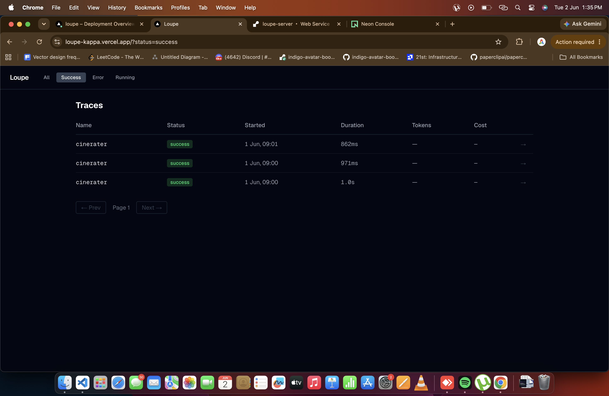
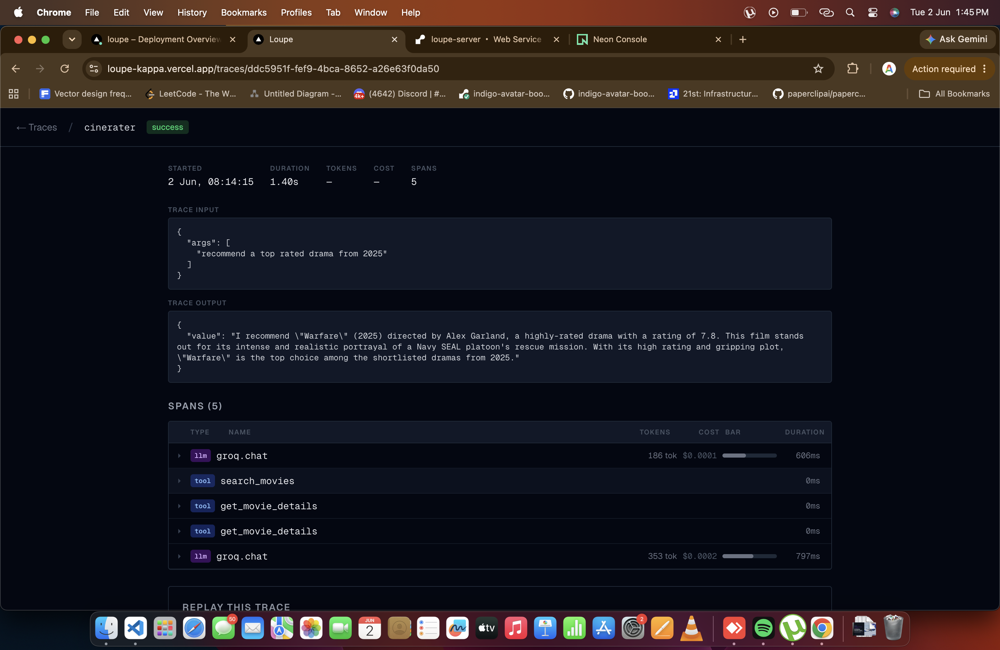
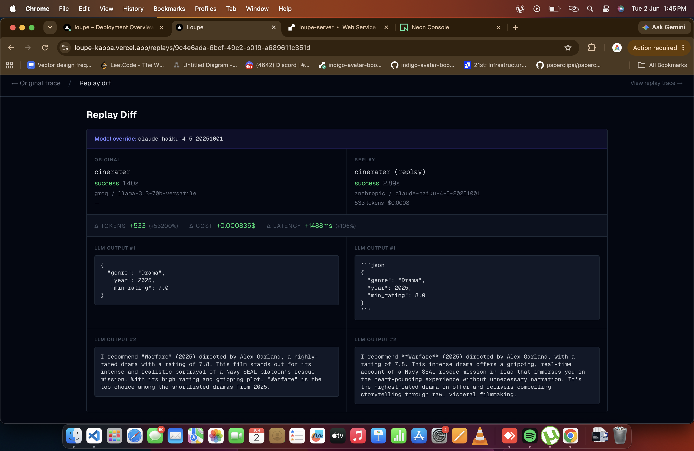

# Loupe

**Open-source observability and replay for LLM agents.**

Instrument your agent with three lines of Python, see every trace in a dashboard, then **replay** any trace with a different prompt or model and compare the outputs side-by-side.

🔗 **Live dashboard:** https://loupe-kappa.vercel.app · **API:** https://loupe-server.onrender.com

> The API runs on Render's free tier and sleeps after inactivity — the first request may take ~30s to wake it.

---

## Why Loupe

Most LLM observability tools stop at *showing* you what happened. Loupe lets you **re-run it differently.**

A buggy agent fails on a query → open Loupe → see the trace → spot the wrong tool call or weak prompt → hit **Replay** with a tweaked prompt or a different model → a side-by-side diff shows the original (failed) run against the new (working) one, with token and latency deltas.

That replay loop is the whole point. Everything else exists to serve it.

---

## Screenshots

| Traces list | Trace detail (span tree) | Side-by-side replay diff |
|---|---|---|
|  |  |  |

---

## Architecture

```
                  ┌──────────────────────────────────────────────┐
   Your agent     │  loupe-sdk (Python)                           │
  ┌───────────┐   │  • @loupe.trace decorator                    │
  │ run_agent │──▶│  • loupe.span() context manager              │
  │  (Python) │   │  • auto-instruments OpenAI / Anthropic / Groq │
  └───────────┘   │  • batches spans, async flush + retry         │
                  └───────────────────────┬──────────────────────┘
                                           │  POST /v1/traces  (X-API-Key)
                                           ▼
                  ┌──────────────────────────────────────────────┐
                  │  FastAPI server  (async SQLAlchemy 2.0)       │
                  │  • /v1/traces  ingest + query                 │
                  │  • /v1/spans   read by trace                  │
                  │  • /v1/replays trigger re-run (BackgroundTask)│
                  │  • API-key auth · Sentry · structlog          │
                  └───────────────────────┬──────────────────────┘
                                           │  asyncpg
                                           ▼
                  ┌──────────────────────────────────────────────┐
                  │  PostgreSQL  (JSONB span payloads)            │
                  │  projects · api_keys · traces · spans · replays│
                  └──────────────────────────────────────────────┘
                                           ▲
                                           │  Server Components fetch
                  ┌───────────────────────┴──────────────────────┐
                  │  Next.js dashboard                            │
                  │  • traces list · trace detail (span tree)     │
                  │  • replay UI · side-by-side diff              │
                  └──────────────────────────────────────────────┘
```

**Deployment:** Vercel (dashboard) · Render (server) · Neon (Postgres) — all free-tier.

---

## Quick start (self-hosted)

You need Docker and Python 3.11+.

### 1. Start Postgres + server

```bash
git clone https://github.com/Adityachauhan12/Loupe.git
cd Loupe
docker compose up -d        # Postgres on :5433, server on :8000
```

The server runs `alembic upgrade head` on boot, so the schema is created automatically. Verify:

```bash
curl http://localhost:8000/health
# → {"status": "ok"}
```

### 2. Create a project + API key

```bash
cd server
python -m scripts.create_project my-agent
# prints a project_id and an API key (lp_...) — copy the key, it's shown once
```

### 3. Instrument your agent

```bash
pip install loupe-sdk
```

```python
import loupe
from groq import Groq

# 1. point the SDK at your server
loupe.init(api_key="lp_...", host="http://localhost:8000")

# 2. auto-instrument your LLM client — every call becomes a span
client = Groq(api_key="...")
loupe.instrument_groq(client)            # also: instrument_openai / instrument_anthropic

# 3. wrap your agent entry point
@loupe.trace(name="my_agent")
def run_agent(query: str) -> str:
    # LLM calls are captured automatically.
    # Wrap tool calls / sub-steps in a span for the full tree:
    with loupe.span("search_movies", type="tool") as s:
        results = db.search(query)
        s.output = {"count": len(results)}
    ...
```

That's it — runs now show up in the dashboard as traces with a full span tree (LLM calls, tool calls, tokens, cost, latency).

### 4. Run the dashboard

```bash
cd dashboard
cp .env.local.example .env.local   # set LOUPE_API_URL and LOUPE_API_KEY
npm install
npm run dev                         # http://localhost:3000
```

---

## Try the example agent

`examples/cinerater` is a small movie-recommendation agent fully instrumented with Loupe — LLM parsing, tool calls, and a final LLM write-up, all captured as one trace.

```bash
cd examples/cinerater
cp .env.example .env        # set LOUPE_API_KEY, LOUPE_HOST, GROQ_API_KEY
pip install -r requirements.txt
python -m examples.cinerater.agent "recommend a thriller from 2023"
```

Open the dashboard → the trace appears → open it → click **Replay** to re-run it with a different prompt or model and diff the results.

---

## Tech stack

| Layer | Choice |
|-------|--------|
| SDK | Pure Python · httpx · pydantic |
| Server | FastAPI · SQLAlchemy 2.0 (async) · Alembic |
| Database | PostgreSQL (JSONB span payloads) |
| Dashboard | Next.js (App Router) · Tailwind |
| Auth | API key (`X-API-Key`), hashed at rest |
| Observability | Sentry · structlog (structured JSON logs) |
| Deploy | Vercel · Render · Neon |

A few design notes (the *why* behind these) live in [`notes/`](./notes), and the full project brief is in [CLAUDE.md](./CLAUDE.md).

---

## Repo layout

```
loupe/
├── sdk/          # Python SDK — published to PyPI as loupe-sdk
├── server/       # FastAPI backend (traces, spans, replays)
├── dashboard/    # Next.js frontend (list, detail, replay diff)
├── examples/
│   └── cinerater/  # demo agent instrumented with Loupe
└── docker-compose.yml
```

---

## License

MIT — see [LICENSE](./LICENSE).
</content>
</invoke>
